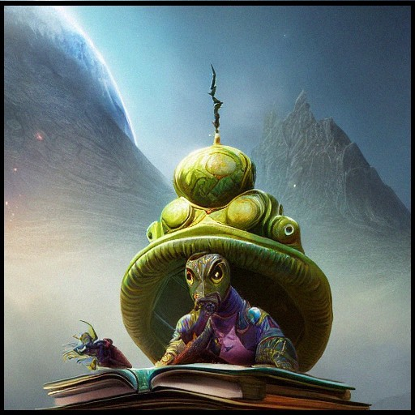

# Zaden Fletchers


```
Zaden Fletcher, the insomniac wizard librarian, never wanted to be an insomniac, nor a wizard, nor a librarian. Yet life was not about what you wanted, but whatever number that cursed die landed on when when the Greatwyrms tooth cut through it. And so, his dreams of being a roasted carrot-on-a-stick vendor at football games were dashed.

As for you, you are just another face. One of the thousands he has seen, and will never see again. Likely, you'll not make it past page ten.
```

## Changelog

2022-11-15 - The Greatwyrms demand that the **Tome of the Reader: A Reference on Using RPG Manager in Traditional Word and Image Form** be released out into the library again. 