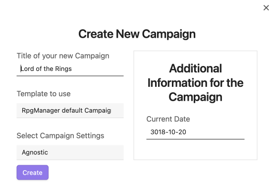

# Creating a Campaign

<--- [**Archives of the Campaigns**](Archives%20of%20the%20Campaigns.md)

Welcome to Creating a Campaign. You may call me **Name**.

You'll find refreshments available in all dietary preferences in the back and gender neutral bathrooms to your left. Got Obsidian Installed? Got your guides? Excellent. Let's get started. 

## Creating Middle Earth

As most of you are #Seed, we're going to start with an example universe more commonly known as the Lord of the Rings. The common lore of the realm heavily focuses on a section of a plane called Middle Earth, which is what we will start with today. However, for our purposes, the Campaign will still be called "Lord of the Rings."

### Opening The RPG Manager Elements Tools

Within your Obsidian Shard, either click on the D20 die on the left sidebar to open up a list of commands within the right sidebar, or open up the command palette with your chosen hotkey. 

If you do not see either of those options, check your settings to see if RPG-Manager is enabled. 

If it is enabled, I suggest you leave this document and [**raise a little white flag**](https://github.com/carlonicora/obsidian-rpg-manager/issues?q=is%3Aissue+is%3Aopen+sort%3Aupdated-desc). I'll send Zaden to clean up your ashes. 

### New Campaign Screen

When you select **Create a New Campaign**, or for those who are #Leaf and #Herb, **Fill a Campaign**, you will receive a pop-up window that will ask for:

- The name of the campaign

- What template you would like to use for the campaign. 
	- This will be the subject of another guide. For now, we will use the default template. 

- What campaign setting you would like to use. 
	- Agnostic: #Clarification
	- Raw: #Clarification
	- Vampire: #Clarification

- What date you want the campaign to start at. 
	- Currently, RPGM supports only the gregorian calendar and time formats. Implementation of [**Obsidian Fantasy Calendar**](https://github.com/fantasycalendar/obsidian-fantasy-calendar) support is expected in the near future. 

In the Lord of the Rings, two popular calendars are [**Shire-Reconking**](https://tolkiengateway.net/wiki/Shire_Calendar) and [**Stewards Reckoning**](https://tolkiengateway.net/wiki/Stewards%27_Reckoning). I had Fantasy Calendar randomize us a year from Stewards Reckoning, and it provided us with the year 3018. Adding in a random date of your choice in that year, go ahead and click **Create**. 

### The Campaign Hierarchy Page

Once you click **Create**, a new note with the name you chose for your Campaign will be generated within the root directory of your vault. You may move it into a folder, a folder note, or leave it there. At first it will appear mostly empty. This is normal. More items will appear as you create **Adventures**, **Acts**, and more. 

>*Psst #Seed , while he drones on. Wherever you place your Campaign File, is where your automatically generated Adventure, Acts, Characters, and other folders will generate. Move that Campaign File first.* 

### Adding a Synopsis

You have your Campaign Page, now it needs a **Synopsis**. 