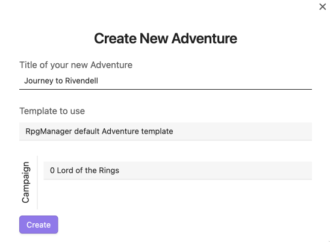
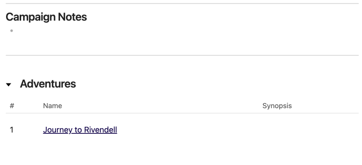
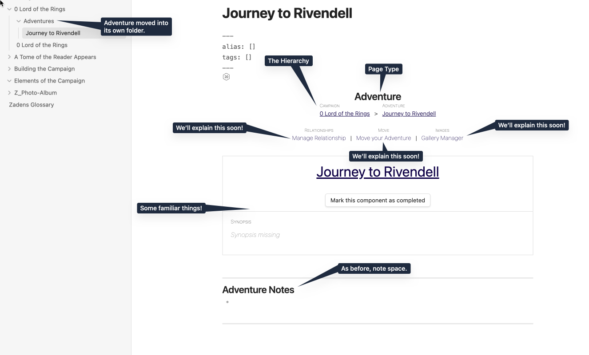

# Journey to Rivendell

<--- [**Creating a Campaign**](../Archives%20of%20the%20Campaigns/Creating%20a%20Campaign.md)

> *The party steps through the door to the next classroom, and finds themselves in a strange place. Green hillsides, sheep, bundles of fresh food, and halflings as far as the eye can see.* 
> *Another step, and the ground feels... cold.. they have no shoes!*

An Adventure is a standalone story arc within the Campaign. The adventure should ideally have a  story incentive to encourage player characters to partake in the story, but as an arc it should have a beginning, a middle, and an end. 

## Creating the Journey to Rivendell

Exactly the same as we created a Campaign, we are now going to create an Adventure. 

- You will be asked to type in the Adventure Name: Type in `Journey to Rivendell`

- As before, it will offer you the choice of template. For now, we will choose default.

- Finally, it will ask you to choose a Campaign. Most of you will only have one, but if you have more and accidently create the adventure in the wrong campaign fret not! We'll show you how to fix it.

Once you have created the Adventure Page, it will appear in one of two places:

1. If you have automatic sorting turned on, it will place the Adventure Page into a Folder called Adventures in the same folder you keep your Campaign Page. 

2. If you do not have automatic sorting turned on, it will place the Adventure Page loosely into the same folder you keep your Campaign Page. 

Additionally, when you create an Adventure, your Campaign Page gains a new feature. You will be able to see a list of your Adventures in an Adventure Block, and the Synopsis for those adventures. The list will automatically attach itself to `Campaign Notes` so if you placed any content below it already like images or dataview codeblocks, those will then be moved below this Adventure Block. 

### The Adventure Page

