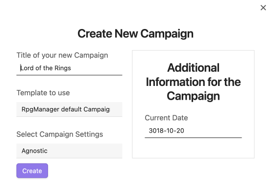

# Building a Campaign


<--- [**Archives of the Hierarchy**](Archives%20of%20the%20Hierarchy.md)


Welcome to Creating a Campaign. You may call me **#Name**.

You'll find refreshments available in all dietary preferences in the back and gender neutral bathrooms to your left. Got Obsidian Installed? Got your guides? Excellent. Let's get started. 

## Creating Middle Earth


As most of you are #Seed, we're going to start with an example universe more commonly known as the Lord of the Rings. The common lore of the realm heavily focuses on a section of a plane called Middle Earth, which is what we will start with today. However, for our purposes, the Campaign will still be called "Lord of the Rings."


### Opening The RPG Manager Elements Tools


Within your Obsidian Shard, either click on the D20 die on the left sidebar to open up a list of commands within the right sidebar, or open up the command palette with your chosen hotkey. 

If you do not see either of those options, check your settings to see if RPG-Manager is enabled. 

If it is enabled, I suggest you leave this document and [**raise a little white flag**](https://github.com/carlonicora/obsidian-rpg-manager/issues?q=is%3Aissue+is%3Aopen+sort%3Aupdated-desc). I'll send Zaden to clean up your ashes. 


### New Campaign Screen

You have two options to create a Campaign: Create, or Fill. The difference between Create and Fill is minimal. 
- Create will create a Brand New Note. 
- Fill will deposit the module data in the current Note. 

It is recommended to **Create** over using **Fill** unless you are an experienced RPGM user and have learned how RPGM interacts with other Obsidian elements and templates. 

When you select **Create a New Campaign**, or for those who are #Leaf and #Herb, **Fill a Campaign**, you will receive a pop-up window that will ask for:

- The name of the campaign

- What template you would like to use for the campaign. 
	- This will be the subject of another guide. For now, we will use the default template. 

#Redo



### The Campaign Hierarchy Page


Once you click **Create**, a new note with the name you chose for your Campaign will be generated within the root directory of your vault. You may move it into a folder, a folder note, or leave it there. At first it will appear mostly empty. This is normal. More items will appear as you create **Adventures**, **Acts**, and more. 

>*Psst #Seed, #Tree, and #Herb, while he drones on... how about I give you a helping hand? Wherever you place your Campaign File, is where your automatically generated Adventure, Acts, Characters, and other folders will generate. Move the Campaign File first. It will make everything much more organized down the muddy-laden road.* 


### Adding a Synopsis

You have your Campaign Page, now it needs a **Synopsis**. 

Hover over the *`Synopsis missing`* row, and to the right a `</>` symbol will show up. **Click it**.


Once you click it. Above the Campaign Page box, the **Page Options Die** icon will disappear and a code block called the **RpgManagerData** block with **YAML** will appear, with many **YAML Keys**. Most of these keys are related to your optional campaign page storytelling details which we will cover in another course. For now, we will focus on the the Synopsis key.

The Synopsis is not a static field, especially on the campaign page. It will grow over time. Fow now, we will add only a few lines to get you comfortable with typing in these structured code blocks. Go ahead and type the following when ready. 

>"The Ring has been found. Mordor awakens. A battle that was once thought over starts again. Frodo and Sam must take the journey of their lives and sacrifice everything and everyone to see the Ring destroyed."

Your results should look like this.


Click anywhere outside of the code block to exit the code block. Now go ahead and-

> **Tree**: Uh #Name ?

What?

> **Tree**: What language is that?

What are you talking about?

> **Tree**: Your Synopsis it says "Lat dad sepaholkal-"
> 
> **Cactus**: You're seeing things Tree. It clearly says "The Ring has been found.. yadda yadda."
> 
> **Tree**: No, look again at the board, it says something in gibberish! Closer if you have to needle-brain.

Will you two stop sidetracking the class. We have a large guide to get through!

> *"You idiots have the passive perception of a walnut," Zaden mutters as he shuffles a cart of books through the back of the classroom.* 


> **Cactus**: See? The Ring has been found. Stupid Tree.
> 
> **Tree**: But.. I know what I saw...

Sit back down or I will turn you all into ash and charcoal!

### How to Change the Campaign Date

If you made a mistake on your campaign date, or you want to change it for any reason at all, it is safest to change it the following way.

Click on the currently filled date on the campaign page, which is currently October 20, 3018. A new popup with a calendar will appear that will allow you to pick the month, year, and then day of your choice.

Alternative, you can edit it manually in the RpgManagerData block in the following format. `YYYY-MM-DD` or `3018-10-20`.


### How to Mark the Campaign or Component as Complete

The deed is done. The monster slain. The world is saved. The princess a peach. Your campaign is over. Now what? Actually, no, that has nothing to do with this.

**Marking a Campaign as Completed**, or in other modules, **Marking a Component as Completed**, allows RPGM to consider the module as no longer in-edit status. Meaning, you are not in the process of building it or writing it. It acts as a `done` check-box, and will not lock the module in any other way. 

You  `Mark this Component as Completed`. 

Made a mistake and need to unmark as completed? Go back into the RpgManagerData by clicking the Page Options Die, and edit the following YAML Key:

- `complete: true`  to become `complete: false`.

The  `Mark this Component as Completed` button will return.

### How to Add Notes

Write. There you go!

Okay, we'll be a bit more explanatory. In every Page that RPGM creates has a NOTES section, RPGM will leave that section open for you to write anything you need, or nothing. Its your space. All yours. Enjoy it. 

Maybe doodle in it?

### How to Add Frontmatter Tags and Aliases

Adding a Tag or an Alias(Aliases for Multiples), is the same as you do it for other notes within Obsidian. 

#### Frontmatter Tags

In YAML, everything has a key and a value. In our case, `tags` is the key and everything after that is our value. Let's say we want our campaign to have the tags `awesome`, `cool`, and `bravo`. With the limitation of frontmatter tags only being able to be recognized as tags if named tags, we are limited to these two options below. 

```
tags: [awesome, cool, bravo]
tags: 
- awesome
- cool
- bravo
```

If we wanted to only have one tag, named `Johnny`, then we gain another option.

```
tags: Johnny
tags: [Johnny]
tags:
- Johnny
```

#### Alias and Aliases

For Alias and Aliases, I recommend reading the [**Obsidian Documentation**](https://help.obsidian.md/How+to/Add+aliases+to+note) on the matter. 

## Next Class

My fine, #Seed  and #Cactus . You have learned enough to move onto the world of **Adventure**! Do get going. Your friends will catch up soon. 

> 🌲 #Tree and 🌿 #Herb, now would be a great time to make any additional campaign pages and associated folders that you need to make for any in-progress or completed campaigns.  


[**Creating an Adventure**](Creating%20an%20Adventure.md) --->