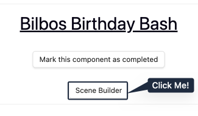
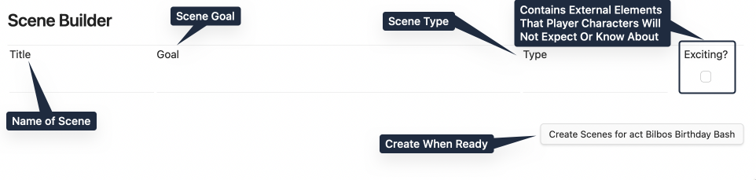

# Forging Many Scenes

> Note: The Scene Builder will be released in RPG Manager 3.2.

> A layer of golden dust settles around the members of the party who arrive in this forge. From the cart in [**Excerpt a Scene**](Excerpt%20a%20Scene.md), it looked like your standard blacksmith shop and forge but inside, everything is in flux, fading in and out of view.

## What is the Scene Builder?

The Scene Builder is a tool that was added to RPGM in the 3.2 release. It currently serves two functions:

1. To outline and add many Scenes to an Act at once. 

2. To interface with the optional Scene Analyser and assist in plotting out a more varied story structure. Calm those murderhobos. Teach those monks that sometimes you need to fight violence with violence. Alternatively, it can help assist in creating plotlines of extremes. We will cover this more in the Optionals Guide. 

## Accessing the Scene Builder

From the **Act** you want to build many **Scenes** into, click on the **Scene Builder** on the **Act Page**.

## The Scene Builder

A new window pops up asking for a title, a goal, a type (more on that in a moment), and if a scene is exciting.

Exciting is defined as "Contains external elements that Player Characters will not expect or know about." For instance:

- If players walk into an Orc Stronghold who are known for being merciless and find bloodthirsty Orcs, that is not exciting.
- If those same players walk into an Orc Stronghold and find them knitting, that is also not exciting, maybe. Unexpected, but not exciting. 
- If those Orcs were finished knitting and then used the blanket to summon a Great Middle-Aged One, that would be exciting.

However, you as the game master, or the storyteller, also define what exciting is. What is exciting in your campaign today, may not be exciting in your next campaign. 

### Scene Types