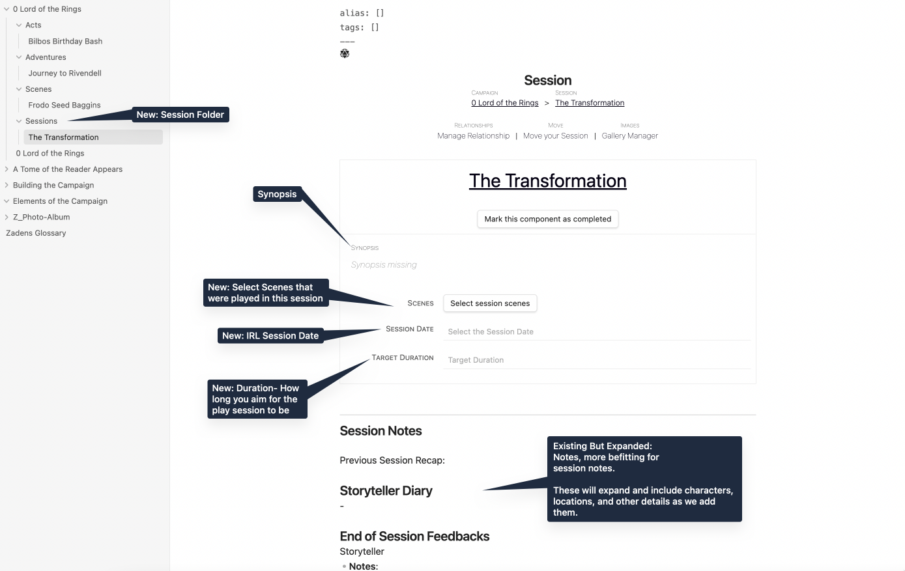

# Generating Sessions

> Fireworks fly and coo in wonder, but Herb, Cactus, and Tree hardly notice the ringing in their ears as they stare at the back of Frodo's head. There was no sign of Seed anywhere, except for the little leaf sticking out the top of Frodo's curls.
>
>"We've just crossed the [**Forging Many Scenes**](Forging%20Many%20Scenes.md)," Gandalf told them. "Next up, Bag End. "

The final yet unofficial piece of the Hierarchy is the Session Note, or Session Page.

## What is a Session Note?

A Session is a in-real-life game session you and your players will play. It is not a plotting component as far as what will happen within the Campaign.

Rather, it is a container of planned and/or completed Scenes, organised to create engagement with players and to assist with summarization of how the session went. It achieves this by having the ability to link up to Scenes that have/will occur during the Session.

## Creating The Transformation

This will be a familiar sequence by now. In the same way you create any other Hierarchy page, go ahead and create a New Session. We named this Session `The Transformation` to reflect what is happening to Seed and Frodo.

## The Session Note

The Session Note is laid out in a familiar way as the other Hierarchy pages, but it does not share in their Hierarchy. Additionally, we have gained some new features.

- IRL Date: The ability to track the days we have In Real Life Sessions
- Expanded Notes
- Target Duration: Choose a target duration for sessions.
  - This also has further, expanded functionality if Scene Analyser is enabled, but can be used as a general gauge without it.

### Existing Features

You have the existing knowledge and ability to do the following:

- [**Adding a Synopsis**](Building%20a%20Campaign.md#Adding%20a%20Synopsis)
- [**How to Mark the Campaign or Component as Complete**](Building%20a%20Campaign.md#How%20to%20Mark%20the%20Campaign%20or%20Component%20as%20Complete)
- [**How to Add Notes**](Building%20a%20Campaign.md#How%20to%20Add%20Notes)
- [**How to Add Frontmatter Tags and Aliases**](Building%20a%20Campaign.md#How%20to%20Add%20Frontmatter%20Tags%20and%20Aliases)
- [**Access the Page Options Die**](Building%20a%20Campaign.md#Adding%20a%20Synopsis)
- [**The Gallery Manager**](Creating%20an%20Adventure.md#The%20Gallery%20Manager)
- [**Moving your Page**](Creating%20an%20Adventure.md#Moving%20your%20Page)

### Existing Features in Stand-By

- [**Manage Relationships**](Creating%20an%20Adventure.md#Manage%20Relationships)

### New Features

With every new module, RPG Manager's functionality is expanded a little bit more. The Session Note page is no exception.

#### Scene Select

To select which scenes are a part of the session, click on **`Select Session Scenes`** on the Session Note. A new window will pop up, asking you to select the scenes. As you can have many scenes, a filter is included to limit the scenes to a specific act.

Check the box next to any scene you wish to add. When done, click **`Add Selected Scenes to Session`**.

The result will look like this on the Session Note. Currently, we only have one scene in this guide as we will be adding more scenes later. #Tree and #Herb may have many more.

#### Storyteller Diary

When you are ready to add notes about a scene to the Storyteller Diary, click on **`Add Scene List to Storyteller Diary`**.

A new area will be added to the notes in the Storyteller Diary for each scene that you added.

A link to the individual **Scene Page** will be added, and a space created to make freeform notes. These should reflect players' and game masters' thoughts and notes about the session, and not their in-game characters.

#### Session Date

As the Campaign Page and Scene Pages track the in-game Date, the Session Notes will track the in-real life date. These currently follow the same values and limitations as the in-game dates:

- The date must be a Gregorian Calendar date
- The date must be in a a recognizable year, month, and date format. Such as **`YYYY-MM-DD`** or **`MM-DD-YYYY`**.

#### Target Duration

Target Duration works primarily for the optional **Scene Analyser** module by ensuring that the amount of scenes planned do not wildly go outside the planned duration.

However, it is good planning in general for any meeting of individuals to have an expectation of how long that meeting will take. Thus, your target duration would be how long you expect that session to take, and planning accordingly.

When clicking **Target Duration**, the box defaults to 12 hours. You may change it to any time of your choosing. Our users report 2-4 hours is their usual session length.

#### Expanded Notes

At the bottom of the Session Notes page, you may have noticed the following text:

> - **Notes**: *This is for the storyteller/game master to fill out.*
> - **Wish**: *This is a question you ask your players.*
> - **Rose**: *This is a question you ask your players.*

A **Wish** is a broad question. Some examples are: "What did you wish changed in the session? What would you have done different? What outcomes were you hoping for?"

These questions are meant to have your players remain free agents in the campaign, and give them internalized ideas (which of course they will not share with you), for the session next time. Additionally, it provides feedback on how they are feeling in response to the story, and if you as a storyteller are needing to make any changes or stay the course.

A **Rose** is more culture specific question. In America on Packers game day, we may equate it as the "Who was the most valuable player?" In Florence, Italy, it may be a question of "Who was the player that brought the most emotion to the table tonight?"

In essence, who do the other players think was the Rose of the session? This is a way of saying thanks to them, publicly. There is a time and place for teamwork, and humbleness, but when a player is great, it needs to be acknowledged and we ought to encourage it.

> **Note**: In the cases where you have players who are embarrassed, shy, and have history of trauma with being seen, feel free to tailor this differently. I (@sigrunixia) recommend stickers, and other nonverbal recognitions of acknowledgement, with everyone getting something but the "Rose" getting the most. Something fun, lighthearted, not threatening, and not a big deal.
>
> It does not take long for the act to become comfortable enough that the players switch to verbal on their own, and stickers go flying!

## Next Steps

> The cart stops in front of the hobbit's hovel. Gandalf steps down with a groan, whereas Frodo hops off with the spryness of youth.
>
>Tree follows closely. **Tree**: Seed? Are you there?
>
>Frodo turns around with a big grin on his face. "Ugh, stop worrying Tree. Isn't it cool? I'm a halfling! Lighten up. Have some of #Herbs shrooms or pipeweed."
>
> Cactus starts shedding needles. Herb pats themselves checking to see if they had taken anything recently. Tree's eyes rolled back into their head and they fell over.
>
>"Oh poor fellow. I think they need some water." Gandalf remarked.

We are done with the Hierarchy. The nitty gritty. The irksome murksome. Now, it is the fun and the games. The characters, the locations, the plots, the world! Get ready to make some halflings, wizards, orcs, places, and events. Head to [**A Player Character Appears**](../Elements%20of%20the%20Campaign/A%20Player%20Character%20Appears.md)
