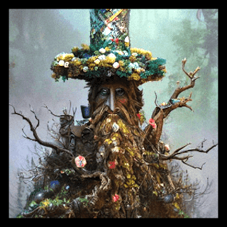

# About This Guide

Welcome to the RPG Manager Getting Started Guide for Beginners. Do not let the beginner language for you, this guide is for new users of the plugin as much as it is for those who have been using it since day one. This is guide to read up on not only see how to adjust a campaign you have created, but to see how to use a new feature that is added to the plugin.

We will be using the setting, situation, and characters of the *Lord of the Rings: The Fellowship of the Ring* (Peter Jackson's Film Version) as our main example in this guide. If we're lucky, we may make it into *The Two Towers*. :) When possible, we will throw in other analogies, humor, or situations, to better explain a concept and how it may tie into your unique campaign.

## The Sorting Tree

First, let's sort you into one of four groups so you can know what to skip and what to pay close attention to in the guide.

>   
> *Oh you may not think I am pretty…. Err, wrong Universe. Ahem  
>A-lalla-lalla What can the Ents do for you? Little Readers

**R1**: I am **Brand New** and I **Do Not Need** To Import Data!  
**Ent**: Ta-runa. You are Little Orc. No? Oh. You are **#Seed** 🌱.

**R2**: I **Need To Import** an **In-Progress Campaign**!  
**Ent**: You are **#Tree** 🌲.

**R3**: I **Need To Import** a **Completed Campaign** (and perhaps **In-Progress** too…)  
**Ent**: ***The Ent is very certain this one is an Orc disguised as a Reader.***

> *"Not even three minutes in and you are already disturbing the peace." The voice of the librarian drones from above. "Roll for deception check." A pair of dice materialize in R3's hands.*

**R3**: Do I just…?

>*"Throw them anywhere. I haven't all day."*
>
> ***DC 15*** **Deception Check** : 1d20+2 -> 15+2 -> **17**  
>
>*The dice disappear.*

**Ent**: Hmmm…You are **#Herb** 🌿.  
**R3**: *`Cool. I totally fooled that tree. Toasty campfire tonight.`*

**R4**: I'm Just **Here To Browse**.  
**Ent**: HARUMPH! I knew you were "Little Orcs."" You are **#Cactus** 🌵.

> The Ent disappears with a pop.

**R3**: "Thanks a lot, Cactmulch. There goes my campfire…"

## What You Will Learn

This guide will teach you step-by-step how to do the following:

1. How to create a new Campaign from Start to Ready-to-Play
2. How to create a Campaign that is already **In-Progress**
3. How to create a Campaign that was **Completed** prior
4. How to create **Player-Characters**, **Non-Player Characters**, **Factions**, and other world-filling fun
5. How to show the **Relationships** between all of the above
6. How to edit all of the above
7. Other useful tools and quality of life knick-knacks to get your storytelling on

## Important Callouts

Due to this guide addressing three use cases (No Import, In-Progress, Completed), you will notice some pages contain a small blurb or callout that looks like the following:

>🌲 **Tree**: Do not proceed to the next step yet. Go back, and repeat steps 1 through 2 for each location you want to add. When completed, you may move onto the next step.
>
> 🌱 **Seed**: We suggest skipping this section for now and coming back when you are ready to add more things.

Please read these carefully as they were added to save you time, maximize your understanding, and get you playing faster.

## Turn the Page

Onward to your next adventure in the **[RPG-Manager Quick Settings](RPG-Manager-Quick-Settings.md)**.

> *As you turn the page, your team and accompanying party is whisked away by a stream of magic and the pungent smell of wet earth.*
