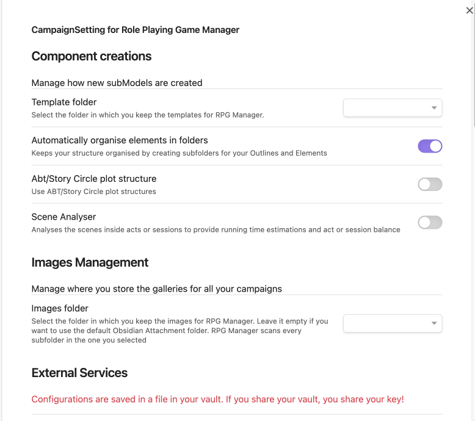
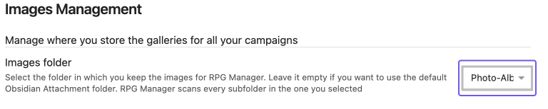

# RPG Manager Quick Settings

*A portal from **[About This Guide](About-This-Guide.md)** forms nearby as it waits for its hosts.*

> *You all arrive with a squelch as your party drops into an active heavy-metal concert. The nearby moshing milmultinupedes cease briefly to look at you with their numerous eyes.*
>
>"**Zignalgyx Twiiiiiiiiiiiizzzz!!!!!!!!!**"
>
> *At the chittering scream, the moshing resumes with fervour.*

---

At this point in time in this guide, we are only going to adjust one thing in the RPG Manager (RPGM) settings: where the plugin looks for images for when we add images to our campaign.

## Settings

Open **Obsidian Settings**.

Scroll down using the scrollbar to the right.

Click on RPG Manager.

If you completed a fresh install, this is usually what your settings screen will look like. What you will need to do is select the Images Folder dropdown, and select which folder you want the plugin to key images for.

The plugin will perform a recursive search on the subfolders, which means it will search subsubfolders, subsubsubfolders, and so on until there are no files and folders left to search.

Once the image folder has been selected, it has been saved in the settings and you may safely exit the settings and return to the vault.

## Next Steps

Proceed to **[The Brief Introduction to Terminology](The-Brief-Introduction-to-Terminology.md)**.

> "*Ah. So that is what happened to the last ones who read this tome. Come along now.*"
>
> The drop of a bucket of popcorn, and the party disappears from the moshing milmultinupedes.
