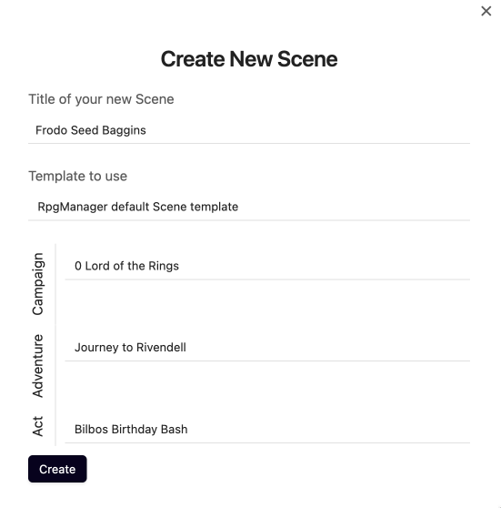
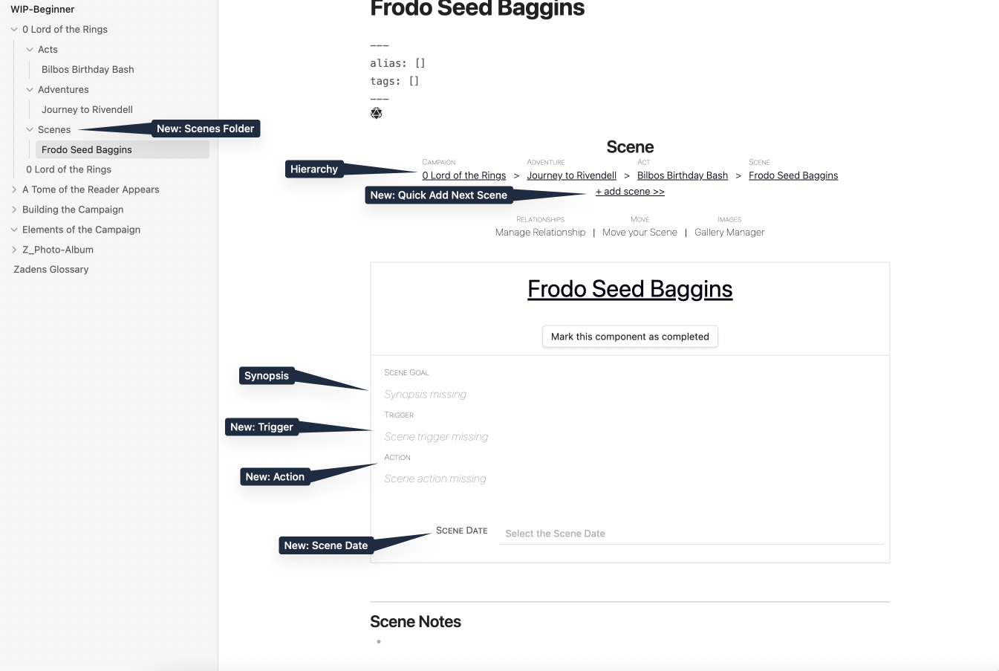
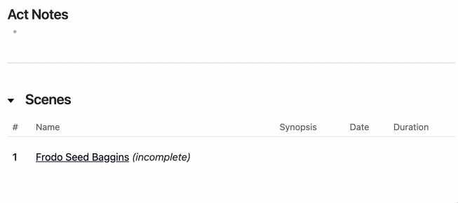
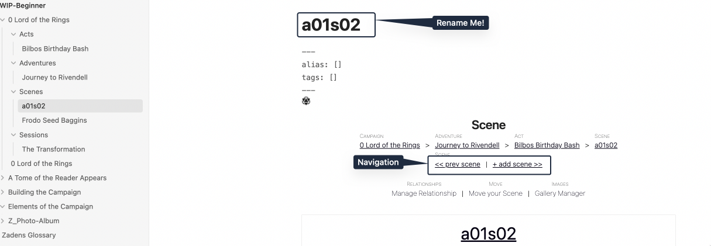
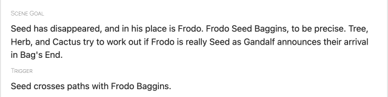
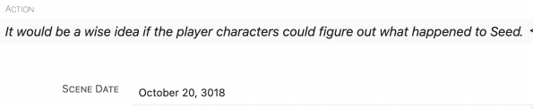

# Excerpt a Scene

As they pass over the final hill of **[Designing an Act](Designing%20an%20Act.md)**, Gandalf breaks out into a
"The road goes ever on and on."

"You're late!" Frodo calls out with crossed arms.

> **Floratsons**: Woah.
> **Seed**: Woah! You think they are gonna say `the thing`? I gotta get closer.
> Seed slinks onto the seat next to Gandalf.

Frodo stares at Gandalf. Gandalf stares back.

> **Cactus**: Appears not.

Frodo's lips begin to pucker.

> **Cactus**: Oh he's crackin!
> **Herb**: Gandalf too, look!

Gandalf starts chuckling under his breath, and its all over for him as he breaks out in a laugh, with Frodo following him. "Oh, its wonderful to-" Frodo jumps forward onto to the cart, right into the path of **Seed**.

> **Tree**: Seed, watch out!
> **Seed**: Oh sh-"-See you Gandalf!"
> **Herb**: Seed, what the?

Frodo hugged the wizard tight then sat down where Seed had been.

> **Tree**: Where is Seed!?

The cart continued moving. Gandalf made no motion that anything had changed.

## What is a Scene?

A scene is the smallest of the hierarchies and it identifies a moment in an **Act** or a
**Session** in which the player characters must **DO** something.

It is important to remember that, with some rare exclusions, the scene should require some input or action from the player characters, to make sure that the story evolves with them and does not become a fixed narrative.

## Creating Frodo Seed Baggins

As we did with Act, Adventure, and Campaign, so now with Scene. Create a New Scene.

We will call ours `Frodo Seed Baggins`.

## The Scene Page

The Scene Page is laid out similarly to the Act Page, but it includes more details.

### Existing Features

You have the existing knowledge and ability to do the following:

- **[Adding a Synopsis](Building%20a%20Campaign.md#Adding%20a%20Synopsis)**
- **[How to Mark the Campaign or Component as Complete](Building%20a%20Campaign.md#How%20to%20Mark%20the%20Campaign%20or%20Component%20as%20Complete)**
- **[How to Add Notes](Building%20a%20Campaign.md#How%20to%20Add%20Notes)**
- **[How to Add Frontmatter Tags and Aliases](Building%20a%20Campaign.md#How%20to%20Add%20Frontmatter%20Tags%20and%20Aliases)**
- **[The Gallery Manager](Creating%20an%20Adventure.md#The%20Gallery%20Manager)**
- **[Moving your Page](Creating%20an%20Adventure.md#Moving%20your%20Page)**

#### Act Page Shows Scenes

The Act Page has opened up a new module and will now show the Scenes that are listed within it. In addition, it will show the duration that scene took if the Scene time was tracked.

#### Quick Add Scenes

A Scene takes input or action from the player characters, even silent ones. Often, they act in unexpected ways, and a new Scene is needed right this second! So, what do we do? We click **Add Scene**.

The result is a brand new scene is created following a specific naming convention. `Act(Number)Scene(Number)`. In this case, a(01)s(02). The file can be freely renamed and it will not break the navigation.

#### Scene Trigger

Not all Scenes always happen. Maybe your players do not go into the scary cave after they cleared the spooky forest, and so the encounter with the friendly, golden spider god never happens. What then? Is the Scene dead into the trash bin? Nope! We still have a trigger.

If that trigger takes place at all in the Act, the Scene can still take place even if it was nor originally within its expected sequence.

Alternatively, if the Scene is not used within the Act, it can be moved to another act, or Campaign.

A Scene Trigger is your writing saver, there to remind you that this content can be used elsewhere someday. It is also there to remind you that the friendly, golden spider god should not appear while the party is currently in the land of spider-eating Ravullers.

In our example, we will be using the following trigger:

> *Seed crosses paths with Frodo Baggins.*

#### Scene Actions

Scene Actions are similar to Scene Triggers, except they are more of a logical "wish list" or a reminder of what player characters should be able to do. We do not want to limit our players, and want to reward them for creativity and out of the normal thinking, but we also want to mark out what is entirely unrealistic actions.

For example, as a very bored professor who has been watching the actions of Herb since they first gained the idea of touching this Tome, I know that they are prone to the unorthodox, and very bloodthirsty. With this knowledge, I would want to include a note that says under no circumstances can Herb hurt Frodo to see if Seed is "Inside of Him."  Similarly, I'd want to put that an action Herb could take is he could try to call Frodo a Seedling, or talk about Signor Fenix and see if he responds.

Why in either case? When plotting out the one scene, it creates focus. When plotting our many scenes with the Scene Builder later, it creates a memory bank.

In this living campaign, we left it broad:

> It would be a wise idea if the player characters could figure out what happened to Seed.

#### Scene Date

The Campaign Page has the date the Campaign first started on (You can also think of it as the Day 0). This is a fixed date, and will not move unless you change it on the Campaign Page. It acts as a reference point for all other date functions within RPGM.

The Scene Page features the Scene Date, which allows you to set a different date independent of the Campaign Date. It can be in the past, in the future, or the same day.

As you add Scenes and through them Characters, Subplots, Events, and other Elements, the change in dates will reflect on those individual pages as well as in the Campaign Timeline.

For now, however, all you may notice is a change on your Scene Page. We issued the same date as the Campaign Date: `3018-10-20`.

## Frodo's Next Steps

> Frodo 🌱 #Seed  Baggins, it is recommended you go ahead and make sure that your Act and Scene Synopsis are filled out, if you have ideas for what they ought to contain. You can also include anything else in those two Pages you think you need to fill out. After that, you have a choice.
>
> You can either go with #Tree and #Herb to begin **[Forging Many Scenes**](Forging%20Many%20Scenes.md) at once, or you can move ahead with and learn the process of [**Generating Sessions](Generating%20Sessions.md)**

## Herb and Trees Next Steps

> 🌿 #Herb and 🌲 #Tree , we waited to have you make your additional Acts until now so you could see how a Scene was laid out. Go ahead and make any additional Acts you need in preparation for the bulk-scenes you will be adding via the Scene Builder in the next part of the guide.
>
> As was recommended to Frodo 🌱 #Seed  Baggins, make sure you fill out as much as you are ready to. Once we get to the Elements, you are not going to have to want to come back and do these small tweaks.
>
> When ready you will begin **[Forging Many Scenes](Forging%20Many%20Scenes.md)**.

## Cactus Next Steps

> Since you are still window shopping, choose one of the paths above and follow one of them.
