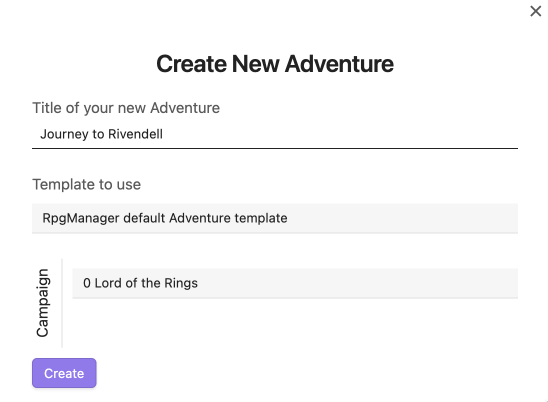
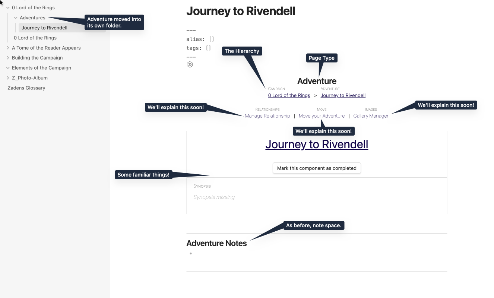
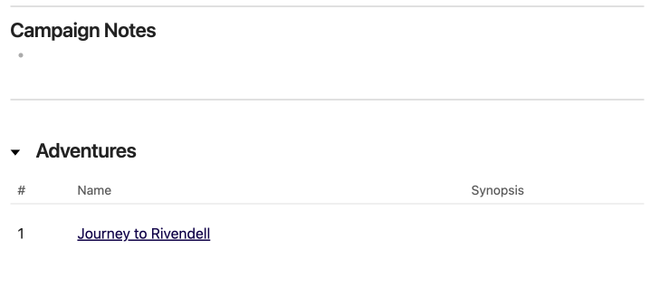
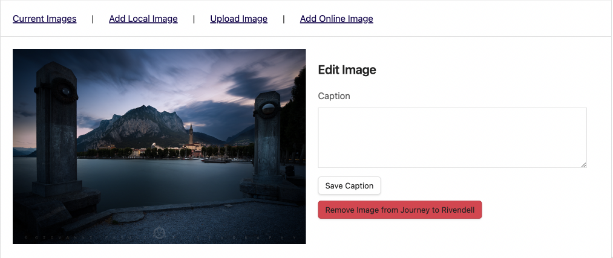
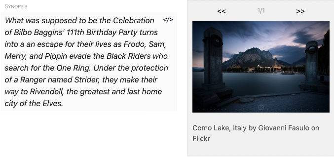
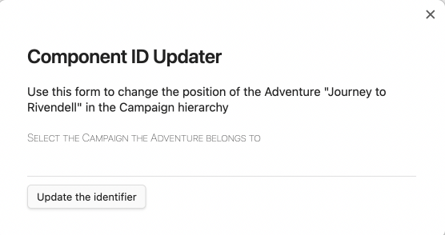
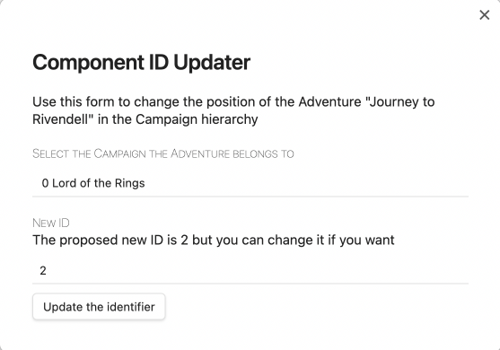

# Creating an Adventure

> *The party steps through the door of [**Building a Campaign**](Building-a-Campaign.md) to the next classroom, and finds themselves in a strange place. Green hillsides, sheep, bundles of fresh food, and halflings as far as the eye can see.*  
>
> *Another step, and the ground feels…cold.. they have no shoes!*

An Adventure is a standalone story arc within the Campaign. The adventure should ideally have a story incentive to encourage player characters to partake in the story, but as an arc it should have a beginning, a middle, and an end.

## Creating the Journey to Rivendell

Exactly the same as we created a Campaign, we are now going to create an Adventure.

- You will be asked to type in the Adventure Name: Type in `Journey to Rivendell`
- As before, it will offer you the choice of template. For now, we will choose default.
- Finally, it will ask you to choose a Campaign. Most of you will only have one, but if you have more and accidentally create the adventure in the wrong campaign fret not! We'll show you how to fix it.

Once you have created the Adventure Page, it will appear in one of two places:

1. If you have automatic sorting turned on, it will place the Adventure Page into a Folder called Adventures in the same folder you keep your Campaign Page.
2. If you do not have automatic sorting turned on, it will place the Adventure Page loosely into the same folder you keep your Campaign Page.

## The Adventure Page

The Adventure Page is laid out similarly to the Campaign Page.

### Existing Features

You have the been taught the knowledge and ought to have ability to do the following:

- [**Adding a Synopsis**](../Building_the_Campaign/Building-a-Campaign.md#Adding%20a%20Synopsis)
- [**How to Mark the Campaign or Component as Complete**](../Building_the_Campaign/Building-a-Campaign.md#How%20to%20Mark%20the%20Campaign%20or%20Component%20as%20Complete)
- [**How to Add Notes**](../Building_the_Campaign/Building-a-Campaign.md#How%20to%20Add%20Notes)
- [**How to Add Frontmatter Tags and Aliases**](../Building_the_Campaign/Building-a-Campaign.md#How%20to%20Add%20Frontmatter%20Tags%20and%20Aliases)

If you have a Synopsis ready, go ahead and add it now. We plan to make ours be the following:

> What was supposed to be the Celebration of Bilbo Baggins' 111th Birthday Party turns into a an escape for their lives as Frodo, Sam, Merry, and Pippin evade the Black Riders who search for the One Ring. Under the protection of a Ranger named Strider, they make their way to Rivendell, the greatest and last home city of the Elves.

If you cannot remember how to add a Synopsis, refer back to [**Adding a Synopsis**](Building-a-Campaign.md#Adding%20a%20Synopsis).

Now, we are going to add our first image.

### New Features

When you add an Adventure to your Campaign, RPGM gains some additional options.

#### Campaign Page Update

Additionally, when you create an Adventure, your Campaign Page gains a new feature. You will be able to see a list of your Adventures in an Adventure Block, and the Synopsis for those adventures. The list will automatically attach itself to `Campaign Notes` so if you placed any content below it already like images or dataview codeblocks, those will then be moved below this Adventure Block.

#### The Gallery Manager

Many modules within RPGM allow you to add images to them, and the list is expanding every patch. Remember how in [**RPG Manager Quick Settings**](../A_Tome_of_the_Reader_Appears/RPG-Manager-Quick-Settings.md) we had you choose your attachments folder? This is for the gallery manager.

There are four ways that RPG Manager will govern images inside the gallery manager:

1. **Add Local Image**: If an desired is inside the defined attachments folder, it will add it to the module's gallery.
2. **Upload Image**: It will allow a user to upload a new image to the attachments folder, and then add that image to the module's gallery.
3. **Add External Image**: Add It will allow linking of external images to to the module's gallery.
4. **Current Images**: Make changes to existing images that have been added to the module's gallery.

In all options, you will have the ability to set the a caption.

We will explore these in more detail when we arrive at the section in the course where we begin adding characters. For now, we will be adding one image in our adventure from out attachments folder.

##### Step by Step Gallery Manager

Step 1. **Click** on Gallery Manager on the Adventure Page

Step 2. **Click** on **Add Local Image**. If you set up an attachments folder and you have images in it, you will see some of those images already.

Step 3. Below **Search Your Image**, **click** on the search bar and put in a search term of your choosing.

Step 4. Once you have found an image you liked, **click** it. You will receive a prompt that states your image selection was successful, click to caption. You do not need to caption, if you do not want to.

Once you click Save Caption, your image is added. Your adventure page Synopsis section will have an image addition next to it.

> 🌱 #Seed 🌲 #Tree 🌿 #Herb
>
> If you have any extra images you want to add to this gallery manager, now is a great time to add them as we will be moving onto the next part of the demonstration.

#### Moving your Page

> ""Oh no Signore Fenice!" you exclaim to me this late in the lesson, "I made multiple campaigns and adventures and put them in the wrong ones. What do I do? It's the end. The end!" You're right, it is the end and you fail. Now come closer so I can burn your little plant bits.""
>
>A donkey pulling a cart of books rolls behind the class. "That's form D.U.M.B in triplicate for #Cactus and form S.A.F.E. in two-stamp for the rest, *Sig-no-reh*." The librarian narrowly avoids the jet of phoenix flame.
>
>"Paperwork. Paperwork. ***She*** is always making me do paperwork. Fine. I'll teach you how to fix it. Watch and learn."

If for any reason you need to move your Adventure to another Campaign, or even to another spot within the same Campaign, it is easy and painless.

On the Adventure Page, click on **Move your Adventure**. You will receive the pop-up below.

If you have multiple Campaigns, you will receive multiple options. Choose the campaign you want the Adventure to be moved to. Once you have done so, the pop-up will change to indicate the Adventure will be assigned a new ID. This is the ID that RPGM used to help keep things in order. It will not rename your module, or otherwise alter any data you have placed.

***We recommend you let RPGM choose what ID to use***.

Once you click **Update the Identifier**, the Adventure will move to the Campaign you selected.

#### Manage Relationships

Managing relationships is heavily reliant upon having the worldbilding elements of the campaign. Characters, locations, factions, and more. We will introduce how to tie in relationships together in its own section after we have added some of these elements later in the guide.

## Next Class

> **Seed**: See Signore Fenice? That wasn't so bad.
>
> *Signore Fenice begins to ember.*
>
> **Cactus**: Oh needles he's going to kill us. Run.. Run!
>
> **Seed**: Nu uh. I ain't being bullied by this bird brained toodle.
>
> *Signore Fenice begins to flare.*
>
> **Seed**: On second thought. Running seems good! Bai~!

Signore Fenice bursts into a golden flame that coils around the the two remaining readers.

"🌲 #Tree and 🌿 #Herb ." The voice takes on a musical quality that was not present before. "This is the time to add any additional Adventures you may need to add. Once that is done, join those two acorns before they hurt themselves." The flame darts upward towards the sky with an angry hiss, becoming the form of a serpent as it flies off toward the sun above.

> **Herb**: Did you see that..?
>
> **Tree**: Yup.
>
> **Herb**: Are we hallucinating?
>
> **Tree**: Nope.
>
> **Herb**: ... Got any shrooms growing on you?
>
> **Tree**: Branch off you knot! Grab the Tome and let's go.

Leaving all their tools, their supplies, save the Tome of the Reader, the party runs, and runs, and runs, far away from prowling Signore Fenice and into the verdant hills of [**Designing an Act**](Designing-an-Act.md).
