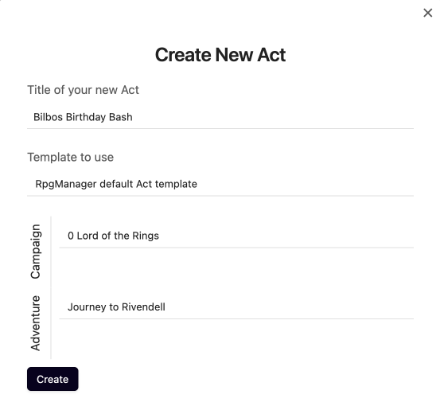
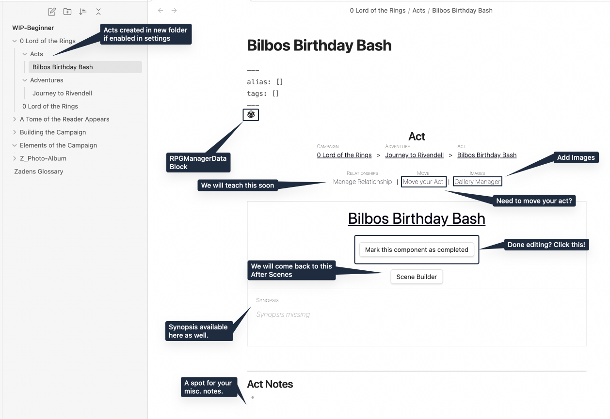
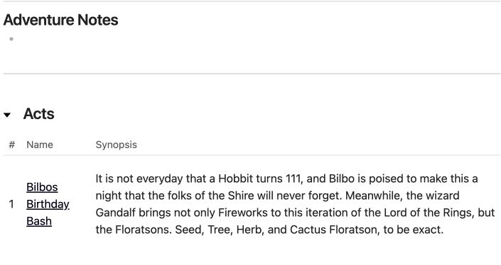
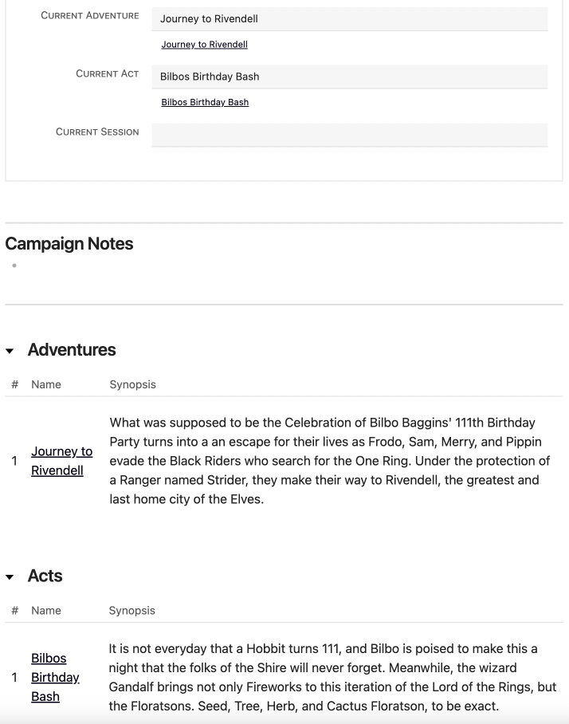

# Designing an Act

Twilight falls as the party of flora readers find their way back onto the main road that came from **[Creating an Adventure](Creating-an-Adventure.md)**, they find themselves at a crossroads.

> **Seed**: We can't go back that way. That angry Signore Fenice will burn us alive.
>
> **Tree**: Yeah. But which of these other ways?
>
> **Cactus**: I bet that Librarian knows.
>
> **Herb**: The one who sticks his nose up at us? Fat chance.
>
> **Seed**: Dude.. that's not cool. He has no nose and its wrong to pick on someone for something they have no control over.
>
> **Herb**: Says the seedling who pissed off our instructor.

"Excuse me fine folk. You need any assistance?"

> **Herb** twirled around. "Hey, we're busy talk- Galdalf?!"

The elder chuckled as he adjusted the brim of his hat. "Apologies to startle you my little friends. You are all quite far from the Shire and are never going to make it on time at this rate. Allow me to provide you a lift but do mind the fireworks in back, they are quite touchy."

> **Cactus**: Make it for what?

"Why Bilbo's 111th Birthday, of course!"

## What is an Act?

An Act is a segment of an Adventure and it should focus on a specific set of circumstances in the story of the Adventure. For example, in this act, we will be focusing on the events of Bilbo's birthday party which will include the arrival of the guests, the preparation of entertainment, normal shire-folk tom foolery, and the act will end when Bilbo's party is over.

## Creating Bilbo's Birthday Bash

This should be a familiar process by now. As we created the Campaign and Adventure, so too do we create the Act. When navigating RPGM, choose either **Create a New Act** or **Fill with Act**.

- You will be asked to create a title. We are using `Bilbos Birthday Bash`

- You can skip the template for now.

- Pick the Campaign you want this Act to be created in. We are using `0 Lord of the Rings`.

- Pick the Adventure you want the Act to Reside in. We selected `Journey to Rivendell`.

Once you click **Create**. A new Act page will be created if you chose to create a new act.

## The Act Page

The Act Page is laid out similarly to the Adventure and Campaign Pages.

### Existing Features

You have the existing knowledge and ability to do the following:

- **[Adding a Synopsis](../Building_the_Campaign/Building-a-Campaign.md#Adding%20a%20Synopsis)**
- **[How to Mark the Campaign or Component as Complete](../Building_the_Campaign/Building-a-Campaign.md#How%20to%20Mark%20the%20Campaign%20or%20Component%20as%20Complete)**
- **[How to Add Notes](../Building_the_Campaign/Building-a-Campaign.md#How%20to%20Add%20Notes)**
- **[How to Add Frontmatter Tags and Aliases](../Building_the_Campaign/Building-a-Campaign.md#How%20to%20Add%20Frontmatter%20Tags%20and%20Aliases)**
- **[The Gallery Manager](../Building_the_Campaign/Creating-an-Adventure.md#The%20Gallery%20Manager)**
- **[Moving your Page](../Building_the_Campaign/Creating-an-Adventure.md#Moving%20your%20Page)**

With the creation of the Act Page, your active RPGM campaign has gained some new functionality.

#### Adventure Page

Your Adventure Page now will list your Acts.

#### Campaign Page

Your Campaign Page will also list your Acts. Additionally, you may notice that the Current Act is now selectable.

#### Scene Builder

The Scene Builder is now an option for you to take advantage of. This is a quick-scene building option to allow you to outline and build out many scenes within an act at once. We will show this functionality after we show how to create a scene and conventionally, because the Scene Builder is meant to take advantage of an optional Scene Analyser, which we'll briefly introduce and show as well.

## Next Steps

"We've just about arrived messers floratsons," Gandalf said with a nod of his head at the bustling village. "I recommend sitting up closer here with me. The children always expect a little-firework show and you are sitting atop on the best ones."

Crawl to the front of the cart to **[Excerpt a Scene](Excerpt-a-Scene.md)** -->
