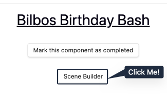
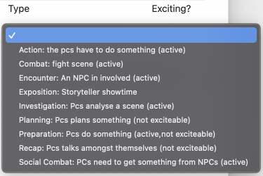
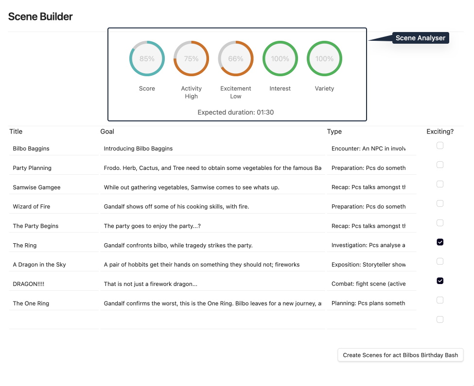

# Forging Many Scenes

> **Note**: The Scene Builder will be released in **RPG-Manager 3.2**.
>
> A layer of golden dust settles around the members of the party who arrive in this forge. From the cart in [**Excerpt a Scene**](Excerpt-a-Scene.md), it looked like your standard blacksmith shop and forge but inside, everything is in flux, fading in and out of view.

## What is the Scene Builder?

The Scene Builder is a tool that was added to RPGM in the 3.2 release. It currently serves two functions:

1. To outline and add many Scenes to an Act at once.

2. To interface with the optional Scene Analyser and assist in plotting out a more varied story structure. Calm those murderhobos. Teach those monks that sometimes you need to fight violence with violence. Alternatively, it can help assist in creating plotlines of extremes. We will cover this more in the Optionals Guide.

## Accessing the Scene Builder

From the **Act** you want to build many **Scenes** into, click on the **Scene Builder** on the **Act Page**.

## The Scene Builder

A new window pops up asking for a title, a goal, a type (more on that in a moment), and if a scene is exciting.

- **Title**: The title of the Scene Note
- **Goal**: The Synopsis or Goal of your Scene. In a perfect world, what will the player characters accomplish? In the actual play, what did they accomplish? What did the storyteller relay?

**Scene Type** and **Scene Excitement** we will explain below in their own sections as they cross into functionality that is used by the optional Scene Analyser.

### Scene Types

**Optional Feature**. This is an optional feature if you do not have **Scene Analyser** turned on in settings.

Scene Types are there to help the Storyteller either build variety in their acts, or guide their acts towards one specific direction. It can be used with or without the input of the Scene Analyser.

The general definition of what each type does is found below.

#### Action

> *After making camp for the night, The Player Characters decide to play a game of "Who can drink the cask of beer the fastest."*

**Player Character Suggestion**: Active

In **Action** scene type is a scene in which the player characters need to **DO** something. From building, to searching, or even studying, this type of scene suggests the player characters to be active and engaging in the scene.

#### Combat

> *The Player Characters are attacked by two rabid wargs.*

**Player Character Suggestion**: Active

A **Combat** scene type is a scene in which the player characters engage in a fight.

#### Encounter

> The party comes upon a lone merchant running towards them on the path. "Beware, beware!" the merchant yells to them in ragged pants, "Orc warg riders on the road ahead." They keep running past, bits and baubles falling out of their pack.

**Player Character Suggestion**: Active

An **Encounter** scene type is a scene in which the player characters have a social encounter with one or more NPCs. These type of scenes are usually for social gatherings, and to receive information.

Encounters do not include the player characters having to work for something, such as utilizing haggling, deception, or perception rolls. For that, there is the **Social Combat** type of scenes.

#### Exposition

> **Galadriel**: The World has changed. I feel it in the water. I feel it in the earth. I smell it in the air. Much that once was is lost, for none now live who remember it. It began with the forging of the great rings. Three were given to the Elves; immortal, fairest, wisest of all beings. Seven to the Dwarf Lords; great miners and craftsman of the mountain halls. And nine, nine rings were gifted to the race of Men who above all else, *desire power*.

**Player Character Suggestion**: Inactive

An **Exposition** scene type is a storyteller-lead scene in which the storyteller present something to the player characters. These type of scenes are generally short in duration and are very useful to introduce a change.

These can also take the form of a non-player character introducing the changes in the story. It is not always a talking head from the sky or behind a board.

#### Investigation

> "There has to be a way out of this room." "Well we better start looking for one."
>
> "Is that blood?" "Why don't you taste it and find out?" "...Rasberry punch. Lovely."

**Player Character Suggestion**: Active

An **Investigation** scene type is a scene in which the player characters must obtain some information from the surrounding environment. These type of scenes are similar to the **Social Combat**, but do not include NPCs from which to collect the information, hence are less social and more active.

Looking for treasure, secret doors, detecting enemies in rooms ahead, and similar checks, are ideal uses for this type of scene.

#### Planning

> **Frodo Seed Baggins**: We'll need some food, cooking supplies-
>
> **Samwise Gamgee**: Bedding, packs, water-
>
> **Meriadoc Brandybuck**: Pipeweed!
>
> **Peregrin Took**: Musical Instruments to entertain everyone with!
>
> **Frodo Seed Baggins**: No!

**Player Character Suggestion**: Inactive

A **Planning** scene type is a player character-lead scene in which the player characters plan how to move and take a decision. Often, these type of scenes are focussed on decisions alone.

#### Preparation

> **Frodo Seed Baggins** packs the food and cooking supplies.
>
> **Samwise Gamgee** packs the bedding, water, and extra sachels.
>
> **Meriadoc Brandybuck** packs the pipeweed.
>
> **Peregrin Took** sits in the corner tied up in rope.

**Player Character Suggestion**: Inactive

A **Praparation** scene type is a player character-lead scene in which the player characters do something after having gone through a **Planning**, as the **Preparation** scenes should not include decisions.

The difference with an **Action** scene is that the **Preparation** scenes are mainly driven by the player characters, while the **Action** ones include external involvement.

#### Recap

> **Peregrin Took**: Hey Sam, what was that funny song you came up with the other day?
>
> **Samwise Gamgee**: I'm still working on it really. I call it a "Potato Rap." Ah-hem. Po-tayt-oes.
>
> Boil-em, mash-em, stick-em in a stew. Boil-em, mash-em, stick-em in a stew.
>
> Goes with carrot, goes with meat, Goes with Parsnip, goes with beet.
>
> Slice as fry, eat as pie,Mash and bake, hash and quake!
>
> Boil-em, mash-em, stick-em in a stew. Boil-em, mash-em, stick-em in a stew.
>
> Add some salt, add some truffle, Got no pepper? Yer in kerfluff-
>
> *Elrond appears within the doorway with his bedrobes on and a scowl on his face.*

**Player Character Suggestion**: Inactive

A **Recap** scene type is a player character-lead scene in which the player characters recap something they have done.

The scene is similar to the **Planning**, but does not involve any type of decision process.

#### Social Combat

> **Samwise Gamgee**: Don't trust the little menance.
>
> **Frodo Seed Baggins**: Sam, please! Okay, Smeagol, how about three fishes, and you'll show us the way?
>
> **Gollum**: Three fishes, no breadsies, three minutes with the preciousesss
>
> **Frodo Seed Baggins**: Four fishes, no bread, no rope around your neck, no ring.
>
> **Gollum**: Raahhhhh! Fine! Four fishieses, no breasies, no rope from bad hobbitses round poor smeagols neck, and no time with the poor preciousness.
>
> **Samwise Gamgee**: I hope you know what you are doing Frodo.

**Player Character Suggestion**: Active

A **Social Combat** scene type is a scene in which the player characters must obtain something from a non-player character through a discussion. The goal is to `win the argument` and it is normally performed through persuasion, intimidation, bartering, haggling, enchantment, or fast talk.

Failure to "win" the social encounter may result in the next Scene moving into Combat.

### Scene Excitement

**Optional Feature**. This is an optional feature if you do not have **Scene Analyser** turned on in settings.

**Exciting** is defined as "Contains external elements that Player Characters will not expect or know about." Another word you can use is **Stimulating**, or **Unexpected**. For instance:

- If players walk into an Orc Stronghold who are known for being merciless and find bloodthirsty Orcs, that is not exciting.
- If those same players walk into an Orc Stronghold and find them knitting. **Unexpected**.
- If those Orcs were finished knitting and then used the blanket to summon a Great Middle-Aged One that is having a mid-life crisis? **Unexpected**, **Exciting**, and **Terrifying**. Get that being a therapist.

However, you as the game master, or the storyteller, also define what exciting is. What is exciting in your Barovia campaign today, may not be exciting in your Wonderlands campaign tomorrow.

### Creating Many Scenes

Now that you have a more in-depth idea of how the Title, Goal, Type, and Excitement work, go ahead and start outlining your scenes.

Here is an example screenshot of what it may look like, with also a sneak preview of the **Scene Analyser**.

Once you click on "Create Scenes for Act", the Builder will deposit all the newly created Scenes within the Campaign Folder, or Scenes Folder depending on your settings, with the naming convention of  `Act(Number)Scene(Number) - SceneTitle`.

## Next Steps

> 🌲 #Tree and 🌿 #Herb
>
> Here is your workhorse and what you will be spending the majority of your inport time on as far as campaign importing outside of characters. Go ahead, and outline all of your scenes for the Acts you have created, and start filling in the in-progress ones that are created.
>
> Scenes generally are expected to be around 10-15 minutes of playtime, but do what feels natural as far as where the story breaks up for any prior information you import. You may find that some of your scenes are longer in history, and they become shorter going forward but that you have more scenes. That is fine. The inverse can also be true, or anything in between.
>
> It is all in what you find works for you.

When you are ready, move onto the process of [**Generating Sessions**](Generating-Sessions.md).
