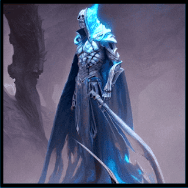
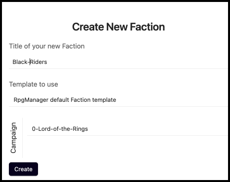
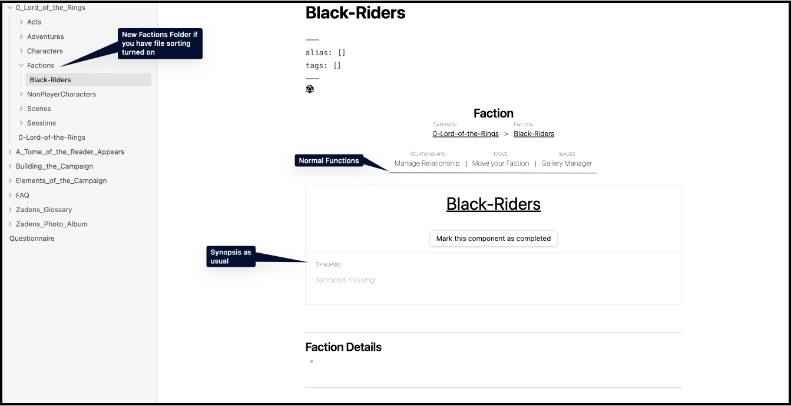

# Dark Riders of Mordor

< --- **[Character Creation](Character-Creation.md)** | **[From Bag End, to The Shire](From-Bag-End-to-The-Shire.md)** --- >

> 
>
> *The Skeletal Cryomancer casts a scornful gaze at nine riders, frozen in blocks of ice and time. "Awaken, otiose drongos! We have use for you." As the ice begins to crack, he snaps a finger nine times. Each snap produces an icicle that hovers nearby. "Follow the shards. It will lead you to your quarry, whom wears a most unique bijou on their finger."*
>
> *The uniform shrieks of rage shattered the ice.*

## What is a Faction?

A faction is a group of player characters and/or non-player characters. They can be as small as a "Party", and as large as a "Corporation." A faction normally has an overarching goal.

## Creating the Black Riders of Mordor

Using the RPG-Manager die-initiated menu, or the command palette, go ahead and **Create** or **Fill a New Faction**.

We're going to name ours the **`Black Riders`**.

> *You may notice we are now using Black-Riders due to a naming convention needed as this vault will be also hosted on Github. You can use spaces freely.*  

Click **Create**

### The Faction Page

You may notice there is nothing new on this page. This is true, for the moment. When we cover Relationships, more will appear on this page.

### Existing Features

You have the existing knowledge and ability to do the following:

- **[Adding a Synopsis](../Building_the_Campaign/Building-a-Campaign.md#Adding%20a%20Synopsis)**
- **[How to Mark the Campaign or Component as Complete](../Building_the_Campaign/Building-a-Campaign.md#How%20to%20Mark%20the%20Campaign%20or%20Component%20as%20Complete)**
- **[How to Add Notes](../Building_the_Campaign/Building-a-Campaign.md#How%20to%20Add%20Notes)**
- **[How to Add Frontmatter Tags and Aliases](../Building_the_Campaign/Building-a-Campaign.md#How%20to%20Add%20Frontmatter%20Tags%20and%20Aliases)**
- **[The Gallery Manager](../Building_the_Campaign/Creating-an-Adventure.md#The%20Gallery%20Manager)**
- **[Moving your Page](../Building_the_Campaign/Creating-an-Adventure.md#Moving%20your%20Page)**

### The Black Riders

## Turn the Page

< --- **[Character Creation](Character-Creation.md)** | **[From Bag End, to The Shire](From-Bag-End-to-The-Shire.md)** --- >

> 🌲 #Tree and 🌿 #Herb, if you have any further factions you wish to create, go ahead and create them even if you have not created any characters for that faction yet.
>
> 🌱 #Seed and 🌵 #Cactus, proceed to the next **[page](From-Bag-End-to-The-Shire.md)**.
