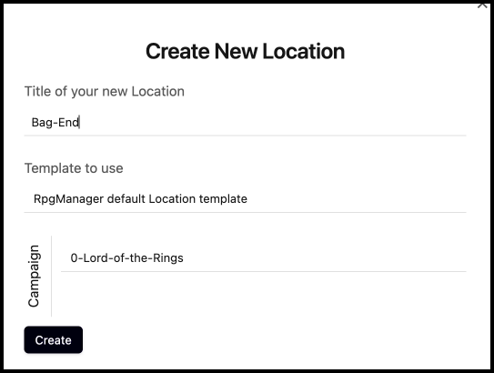
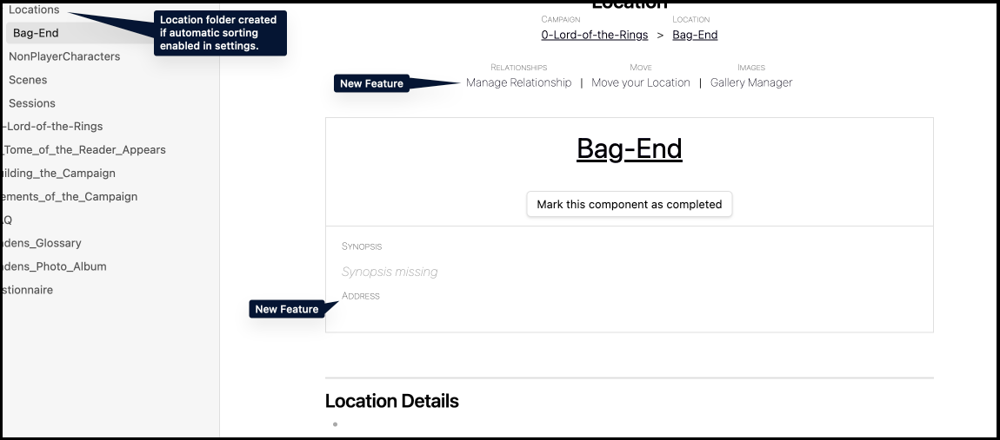
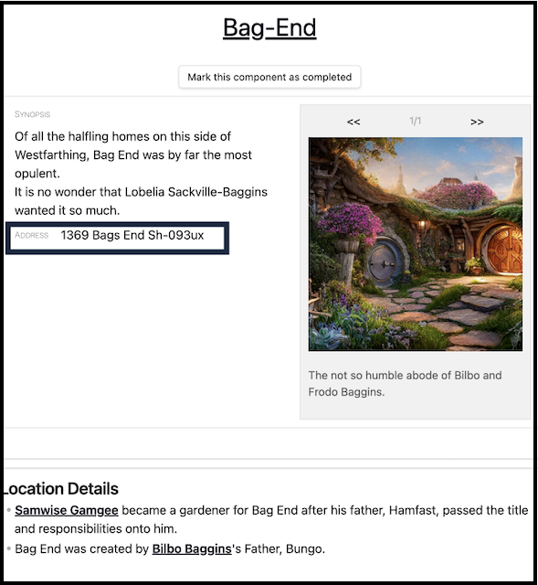
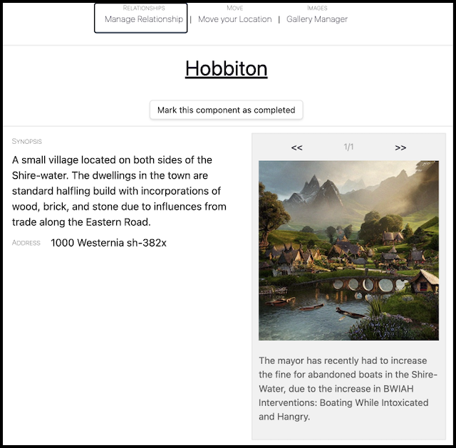
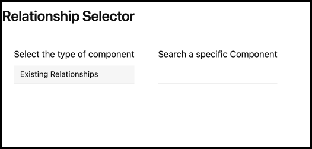
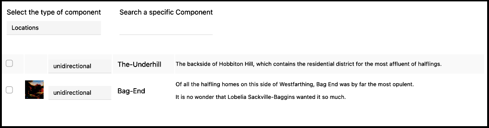
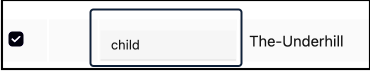
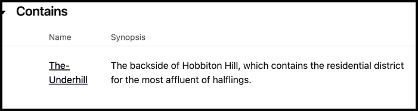
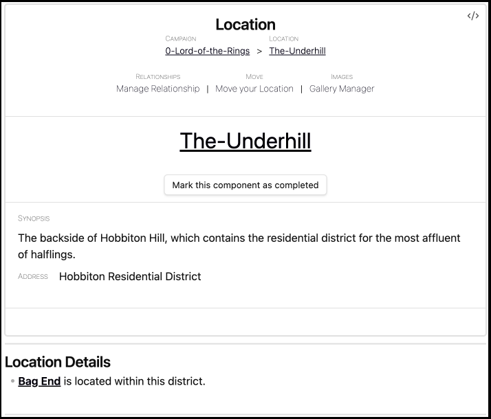
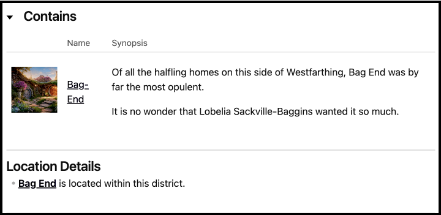

# From Bag End to the Shire

> *Back at Bag End…*
>
> **Samwise**: Oh no oh no oh no…
>
> **Frodo**: It's not all bad Tree. Being in these bodies. We get to be the main characters!
>
> **Herb**: If #Seed became Frodo.. and #Tree became Samwise.. who is going to become Merry and Perrigin?
>
> Gandalf opened one eye in between puffs of his pipe. "Who do you think? I can think of only one of you who is the most **`fool`** of them all."

## What is a location?

A location is a place in the campaign the Player-Characters (PC) or Non-Player Characters (NPC) are living in. RPG Manager (RPGM) does not discriminate or require a specific size, as it can be as big as a country, or as small as a drawer.

Locations are where characters will live their stories, and while not all may be worth creating in RPGM (That is alll up to you!) , but those with more interest, or the ones that are recurring, we highly recommend creating.

## The Land of the Halflings

In this section of the Beginner's Guide, we are going to take you through the full creation of Bag's End, and then we are going to dip our toes into managing relationships to show how Bag's End can link up as a location to The Shire.

## Creating Bag End

From the command palette, **Create** or **Fill a New Location**.

For this guide, we are going to start with making **`Bag-End`**.

### The Location Page

The Location Page matches the same layout as all the prior pages.

#### Existing Features

You have the existing knowledge and ability to do the following:

- **[Adding a Synopsis](../Building_the_Campaign/Building-a-Campaign.md#Adding%20a%20Synopsis)**
- **[How to Mark the Campaign or Component as Complete](../Building_the_Campaign/Building-a-Campaign.md#How%20to%20Mark%20the%20Campaign%20or%20Component%20as%20Complete)**
- **[How to Add Notes](../Building_the_Campaign/Building-a-Campaign.md#How%20to%20Add%20Notes)**
- **[How to Add Frontmatter Tags and Aliases](../Building_the_Campaign/Building-a-Campaign.md#How%20to%20Add%20Frontmatter%20Tags%20and%20Aliases)**
- **[The Gallery Manager](../Building_the_Campaign/Creating-an-Adventure.md#The%20Gallery%20Manager)**
- **[Moving your Page](../Building_the_Campaign/Creating-an-Adventure.md#Moving%20your%20Page)**

#### New Features

##### Address

The **Address** field is for flavor on locations, and less to do with a linking between **Elements**.

In Lord of the Rings, we are not introduced to the concept of postal codes alongside their post office, but let's assume there is a standard and logical system. Upon creating a fake address in the form of **`1369 Bags End Sh-093ux`**, Bag End now has a local address on top of it's soon to be regional address.

## Creating More Elements

#Seed #Tree #Herb #Cactus

In order to effectively introduce the basics of Location Relationships, you will need to have several related locations ready to be linked together. Think of a City, State, Country, or a Bedroom, House, and Yard.

If you have any to make, please proceed to at this time.

When you are ready, move onto the next section.

## Managing Location Relationships

The Location Relationship currently supports three relationship types: Unidirectional, Bidirectional, and, Parent and Child.

**Unidirectional** relationships are entirely one-sided. The woman owns the purse. The villain enslaves one politician. The orc owns a fishing boat. Water shoots out, and fire is out of here!

**Bidirectional** relationships are reciprocal. Tera and Jody are sisters. The villain employs their henchmen. The orc asks the fish to get into the boat. Water and electricity make shock-and-awe.

**Parent** and **Child** relationships are exclusive to Location Relationships, and are one parent, to many children. In metaphor terms: A queen rules her ant colony. The villain controls the galaxy, absolutely. The Amazonian Primus oversees many billions of boxes.

We will review this again, and in more depth, when we move onto the the formal introduction of Guiding your Relationships.

### Hobbiton

This is Hobbiton, a village close to Bag End.

When ready to begin working on linking this village to Bag End, click on **Manage Relationship**. The relationship selector will pop up.

If there are relationships already linked, whether manually through this pop-up or through direct linking within the note, they will show up here. Click on **Existing Relationships** to toggle the selection box. Select the **Locations** option.

You will see we have two options - Bag End and The Underhill - to choose from. Bag End is located within The Underhill, so we are going to focus on **The Underhill**.

Check on the checkbox next to **Unidirectional** which is next to The-Underhill. Then, click on the undirectional bar. Change Unidirectional to **Child**.

Now exit out of the relationship manager. You should see a new box on your Hobbiton page.

### The Underhill

You'll notice that The Underhill does not show anything about the the relationship with **Hobbiton** proper. Currently, this is intended but this may be changed in a future #Release.  

However, we do need to add the relationship with Bag End. In the screenshot you do see a link to Bag End, which adds a soft-relationship in the Relationship Manager, but I want to see that **Parent-Child** relationship again for this one.

Let's go ahead and go into the Relationship Manager, and make that change like we did on Hobbiton.

There we go. Bag End really looks lonely. Be sure to add some neighbors later when you have a chance.

## Next Steps

That was the basics of managing your location relationships. In the next few Element sections, we'll continue to add in additional relationship introductions to you.

> The group heads from Bag End to Hobbiton proper as nightfall will arrive soon and Gandalf will need time to put together his fireworks. Frodo holds a despondant Sam, #Cactus plucks out needles and throws them at random trees as the cart rolls back, and #Herb looks around nervously for any sign of familiar halflings.
>
>Feeling uncomfortable near the others, #Herb climbs into the back of the cart with the fireworks and hides next to a group of burlap sacks. They've read the story, they know how this goes. Carefully, they pull out a small roll of paper and a pouch of combustomille and begin rolling in between the jostling of the cart. When they got to Hobbiton, this was going to be the stress relief and sleep they needed.
>
>"It's rude not to share mate."
>
> #Herb stopped mid roll to the appearance of two pairs of luminous eyes peeking out from inside two burlap bags.

**Next Mission**: **[Missing-Fireworks-A-Quest](Missing-Fireworks-A-Quest.md)**
