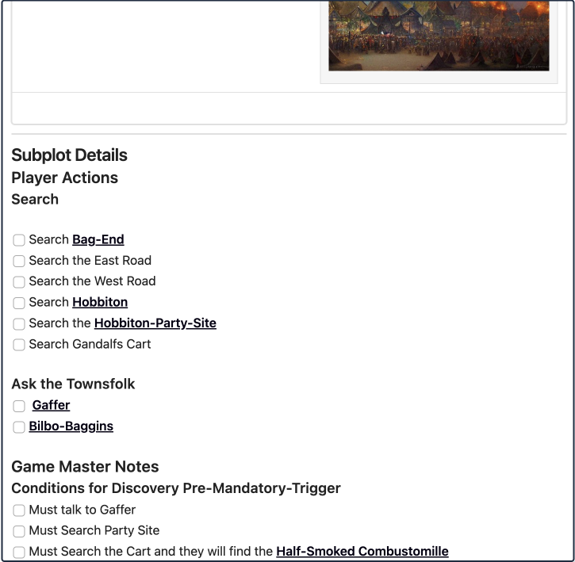
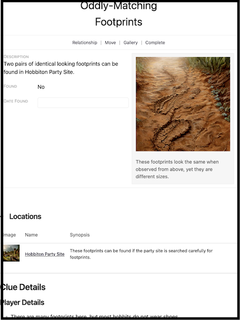
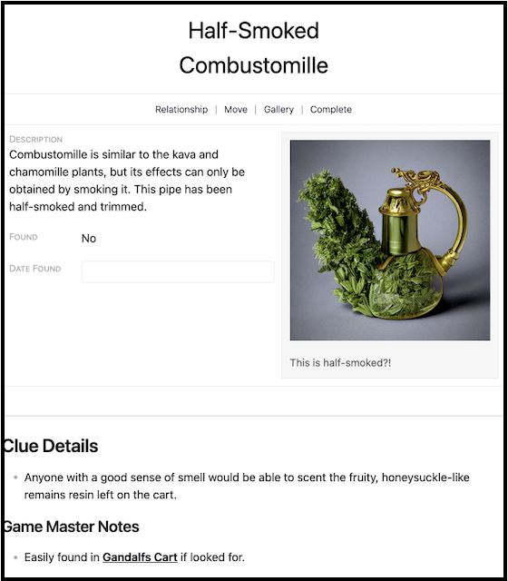
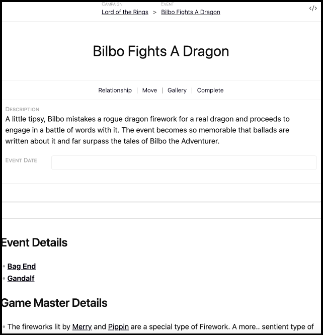

# Missing Fireworks-A Quest

< --- **[From Bag End, to The Shire](From-Bag-End-to-The-Shire.md)** | **[Music to Our Ears](Music-to-Our-Ears.md)** --- >

> "So you'll leave me alone and never come near me again, if I make a distraction so you can take this?"
>
> "Yup." "Absolutely." "Swear on our honor."
>
> #Herb looked around as the cart crossed the bridge that marked their arrival into **[Hobbiton](../The_Lord_of_the_Rings/Locations/Hobbiton.md)** proper. "Fine. Beees!" They twisted and hefted themselves over the side of the cart, landing in the dirt and mud below. "It's trying to get me! Get away!"
>
> As the cart pulled to a stop and a very concerned wizard and some halflings checked out their friend, another pair of halflings slipped out the other side of the cart with a very, very long package.

In every story or campaign there is an overarching end-point or goal:

- In *Shawshank Redemption*, it is Andy obtaining his innocence.
- In the *Harry Potter* series, it is Harry becoming free of the threat of Voldemort.
- In the *Lord of the Rings*, it is to destroy the One Ring.

What we end up with in each of these stories is not quite as clear cut:

- Andy does not obtain his innocence. Instead, he obtains his freedom but has to shed nearly everything he was.
- Harry learns the problem is not just Voldemort, but the expectations everyone else has of him.
- Frodo nearly did not destroy the One Ring, and it took the actions of the **[deity behind the curtain](https://tolkiengateway.net/wiki/Ilúvatar)** in order for everything to line up correctly.

What these circumstances all have in common, is a combination of subplots and clues.

## What is a Subplot?

A **Subplot** is a storyline which runs inside the main campaign, with a specific objective that may or may not be directly related to the overall plot of the campaign.

- They can be as small as a single fetch-quest or deliver-quests.
  - **Boar-Hater**: *Retrieve 30 Boar's Tusks for Boar-Hater*.
  - **Got No Legs**: *Take this package to Lt. Dan's Sister in Texaco*.
- They can also be as large as multi-adventure plots that can split off and alter the outcome of the main campaign
  - **The Enemy of my Enemy is still my Enemy**: *Further sour the relationship between a previously hated corporation and ours. We are now fighting a war on two fronts*.
  - **The Enemy of my Enemy is my Friend**: *Gain the maximum trust of a previously hated corporation to have their assistance fighting against the Twix*.
- They can be personalized, unique, and, used as a way for tracking specific happenings across acts and adventures:
  - Volikar's Debts: The Vampire Lord Magnus is a generous lender of favors. Unfortunately for Volikar, the young fledgling may have bitten off more than he can clean up.
  - Journal of 1,000,000 Strikes: The Dragonic Monk was always told it takes 1,000,000 strike's to reach perfection in any technique. Taking this lesson to heart, she keeps track and logs every successful hit she lands in her goal to perfect every technique she has learned.

The sky is the limit for how you want to craft a subplot.

The Subplot as a RPGM Element exists to help organize **Events** and **Clues** related to these extra storylines.

## What is a Clue?

A **Clue** is an joining Element which is meant to signify two seemingly unrelated Elements are tied to one another. In a clue that is linked to a:

- Location, it could mean that there is a treasure room if a player does an investigation or perception check. It could also mean that there is something related to a Subplot in that location.
- Character, it could mean that person may need to be talked to, or they hold an item of significance.  
- Event, it could mean that there is something about the event circumstances that provides a clue for this going forward.
- Subplot, the clue may be a part of the objective of the subplot, or tied directly to the subplot. Additionally, it an be indicated that something here can help move the subplot along but otherwise not directly related. For example, pickpocketing a key from a guard to open a gate, to gain access to a new area that contains more about the subplot or related clue.
- Another Clue. Clue's being tied directly to clue's when not a part of a location or a subplot are not as common. You may see them more when a clue is broken up across regions or entities.

## What is an Event?

An **Event** is an Element which records something that happened or will happen during the course of the Campaign. Events are *generally* related to Clues, Locations, Factions, and Non-Player Characters. The events are mainly part of world building, to give context to the story, and to provide information to the player characters.

## Existing Features

You have the existing knowledge and ability to do the following:

- **[Adding a Synopsis](../Building_the_Campaign/Building-a-Campaign.md#Adding%20a%20Synopsis)**
- **[How to Mark the Campaign or Component as Complete](../Building_the_Campaign/Building-a-Campaign.md#How%20to%20Mark%20the%20Campaign%20or%20Component%20as%20Complete)**
- **[How to Add Notes](../Building_the_Campaign/Building-a-Campaign.md#How%20to%20Add%20Notes)**
- **[How to Add Frontmatter Tags and Aliases](../Building_the_Campaign/Building-a-Campaign.md#How%20to%20Add%20Frontmatter%20Tags%20and%20Aliases)**
- **[How to Enable Fantasy Calendar Support](Building-a-Campaign.md#How%20to%20Enable%20Fantasy%20Calendar%20Support)**
- **[The Gallery Manager](../Building_the_Campaign/Creating-an-Adventure.md#The%20Gallery%20Manager)**
- **[Moving your Page](../Building_the_Campaign/Creating-an-Adventure.md#Moving%20your%20Page)**
- **[Managing Location Relationships](From-Bag-End-to-The-Shire.md#Managing%20Location%20Relationships)**

## The Missing Fireworks

In this part of the guide, we are going to do something a little bit different. 

You already know how to add new pages, and the Subplot, Event, and Clue pages all have the same format as prior pages and do not have any new features. We're going to practice more relationship linking.

Go ahead and create the following.

1. Make a Subplot. If you are following the guide word-for-word, name it "The Missing Fireworks."
2. Make two Clues. If following the guide, name one clue, "Oddly-Matching Footprints" and the other clue, "Half-Smoked Combustomille."
3. Make an Event. If following the guide, name it "Bilbo fights a Dragon".

When you have made them, go ahead and fill out the Synopsis/Descriptions as you would like if you made your own. Pictured below is our guide examples that will be found in the Lord of the Rings Vault.

### Subplot - The Missing Fireworks

### Clue - Oddly-Matching Footprints

### Clue - Half-Smoked Combustomille

### Event - Bilbo Fights a Dragon

## The Trifecta of Relationships

Now that we have a subplot, some clues, and an event at the end of the subplot, let's begin tying how they all interact. 

Starting with the event. 

