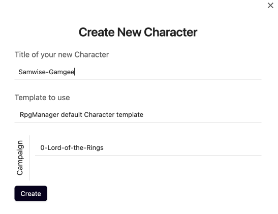

# A Character Appears

> Frodo and another, stockier hobbit roll a large barrel up the incapacitated, seemingly dehyrated hobbits. The stocky one pulled out the cork.
>
>"Careful Gamgee. We musn't overwater them." Gandalf warned as he repacked his pipe with pipeweed.
>
>"You're lucky I respect you Mr. Gandalf Sir." Samwise said as he gently watered the hobbits. "You don't see me telling you how to wave your magic around."
>
> Frodo ducked behind a door inscribed with the words [**Generating Sessions**](../Building_the_Campaign/Generating-Sessions.md) and started laughing.

Welcome to the Elements of a Campaign. Unlike the [**Archives of the Hierarchy**](../Building_the_Campaign/Archives-of-the-Hierarchy.md), we're going to dive on in and explain how to build each Element as much of the existing knowledge you have gained applies here as well.

We'll be going over how to make Player Characters and Non-Player Characters as they have the same options and creation process.

## What is a Player Character?

A [**Player-Character**](../Zadens_Glossary/Player-Character.md) (PC) is a character who is directly or indirectly controlled by a player, and sometimes a character controlled by the Game Master (GM). They are the not the center of the campaign, but can be considered some of the characters with the most agency.

## What is a Non-Player Character?

A Non-Player Character (NPC) is a character who is directly or indirectly controlled by the Game Master or randomly generated within the Campaign. They have no agency within the campaign, but they are one of the most important worldbuilding factors within the campaign.

## Creating Samwise Gamgee

You know what to do. Let's go to the normal RPG-Manager menu and choose **`Create a Character`**. If you have an existing Character file you want to use RPG Manager with, choose **`Fill with Character`** instead.

- You will be asked to create a title. We are using **`Samwise Gamgee`**

- You can skip the template for now.

- Pick the Campaign you want this Act to be created in. We are using **`0 Lord of the Rings`**.

#redotoosmall

## The Character Page

### Existing Features

You have the existing knowledge and ability to do the following:

- [**Adding a Synopsis**](../Building_the_Campaign/Building-a-Campaign.md#Adding%20a%20Synopsis)
- [**How to Mark the Campaign or Component as Complete**](../Building_the_Campaign/Building-a-Campaign.md#How%20to%20Mark%20the%20Campaign%20or%20Component%20as%20Complete)
- [**How to Add Notes**](../Building_the_Campaign/Building-a-Campaign.md#How%20to%20Add%20Notes)
- [**How to Add Frontmatter Tags and Aliases**](../Building_the_Campaign/Building-a-Campaign.md#How%20to%20Add%20Frontmatter%20Tags%20and%20Aliases)
- [**The Gallery Manager**](../Building_the_Campaign/Creating-an-Adventure.md#The%20Gallery%20Manager)
- [**Moving your Page**](../Building_the_Campaign/Creating-an-Adventure.md#Moving%20your%20Page)

### New Features

With the creation of a Character Page, your active RPGM campaign has gained some new functionality.

#### Goals

Certain Elements contain Goals, which allow you to help keep track of the motivations of your character. What are some things they want to accomplish?

For Samwise Gamgee, we know he is a Gardener and loves Potatoes, so we're going to make one of his goals be: **`Grow the biggest Potato in the history of The Shire.`** Now we're going to add some more.

**`Meet a Tree-Man.`**

**`Marry Rosie.`**

**`Keep Mr. Frodo out of trouble.`**

**`Not necessarily in that order.`**

#### Date of Birth

The **Date of Birth** interfaces with the Campaign Date on the Campaign Page, and the Current Date set by the Scene Pages, to calculate the character's current age.

Much like setting the Campaign Date, click on the bar next to **Birth** to open a calendar to select the Date of Birth.

Once that is selected, two new fields appear.

**Status** will display if the character is **Alive** or **Dead**.

**Age** will display the character's calculated age based on the most recent **Current Date**.

#### Date of Death

The Date of Death interfaces with the Date of Birth and the Date of Death to calculate the age the character was when they died.

Similar to selecting a Date of Birth, click on the bar next to Death to select the Date of Death.

##### Sam is Not Dead

If you make a mistake, and need to mark a character as alive again, select the Date of Death bar and click backspace or delete, dependent upon your locale, to clear the date out. The status of the character should revert back to Alive.

#### Pronouns

A Player Character and Non-Player Character can choose to select a personal pronoun. This has no functional bearing on how RPG-Manager operates, but it may change how some text is displayed in reference to that character.

To select a Pronoun, click on the box next to Pronoun and select your pronoun. If the Pronoun you use is not listed, please create a new [**Feature Request**](https://github.com/carlonicora/obsidian-rpg-manager/issues/new/choose).

#### Campaign Page Update

The Campaign Page has updated to begin listing your Player Characters in the Campaign.

As of the 3.2 #Release there is not a way to filter out Player Characters shown on this page.

## Next Steps

> **Tree**: You stay away from me! I got a branch, and I'm not afraid to use it!
>
> **Herb**: Tree, put down the branch. Come on dude, let's talk about this.
>
> *Tree takes a step back and begins to trod onto the perfectly manicured garden.*
>
> "That does it. You're ruining Mr. Frodo's flowers." Samwise reaches for the errant halfling.
>
> **Tree**: I said stay away!
>
> **Tree** charges forward, branch in hand. A heavy swing, but the branch sinks right through Sam, and Tree finds themselves colliding into the gardener. They fall together in a heap of dirt and flowers.

---

> 🌲 #Tree and 🌿 #Herb, if you have any more player characters, now would be a great time to go ahead and make them. You might want to wait on Non-Player Characters until we go over Relationships.
>
> 🌱 #Seed and #Cactus, feel free to move on ahead to [**Black Riders of Mordor**](Black-Riders-of-Mordor.md).
